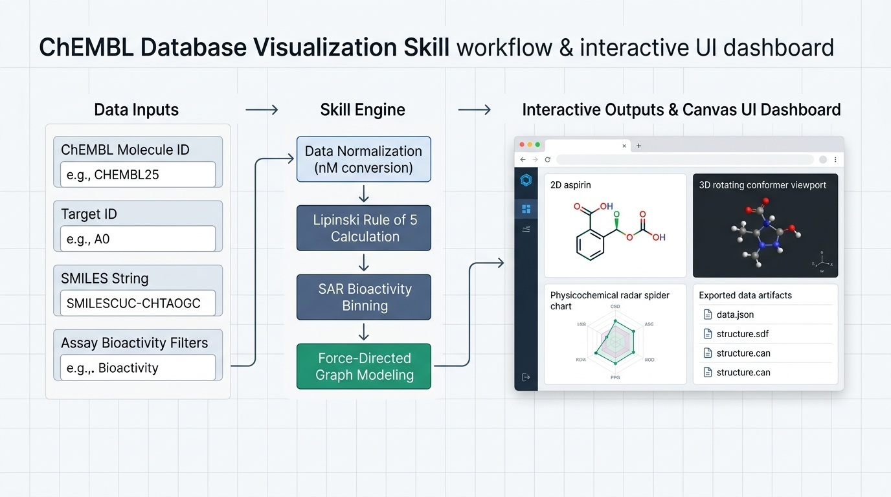

# ChEMBL Database Visualize Skill

## 1. Overview
The `chembl-database-visualize` skill provides programmatic query capabilities and visual analytics for EMBL-EBI's ChEMBL bioactivity database. It synthesizes compound properties, biological targets, concentration-normalized assays, and chemical similarity networks into self-contained, interactive web dashboards (`dashboard.html`).



The workflow diagram above illustrates the end-to-end architecture:
1. **Data Inputs**: Ingests compound identifiers (ChEMBL IDs), biological target IDs, SMILES chemical notation, and bioactivity assay criteria.
2. **Skill Engine**: Performs automated nanomolar (nM) unit normalization, Lipinski Rule of 5 physicochemical calculations, SAR bioactivity binning, and network graph modeling.
3. **Interactive Outputs and Dashboard**: Emits standardized JSON/SDF data artifacts and compiles a standalone HTML/JavaScript dashboard featuring synchronized 2D chemical topologies, 3D WebGL rotating conformer viewports, and physicochemical radar charts.

### Key Capabilities
- **3D Conformer and 2D Vector Structural Visualizations**: Renders interactive WebGL conformers via 3Dmol.js alongside 2D vector diagrams with element-specific color coding.
- **Physicochemical Profiling**: Automated calculation of Lipinski Rule of 5 parameters (MW, AlogP, HBD, HBA, Rotatable Bonds, TPSA) with rule-violation detection and an SVG spider/radar chart.
- **SAR & Bioactivity Distributions**: Standardization of bioactivity measurements into nanomolar (nM) concentrations, computation of negative logarithmic affinity (pIC50), and rendering of potency histograms.
- **Clinical Development Tracking**: Stage timelines mapping compounds across Preclinical, Phase I, Phase II, Phase III, and Approved statuses, coupled with Mechanism of Action and ATC/MeSH indication cards.
- **Chemical Similarity and Analog Matrix**: Tanimoto similarity scoring and dynamic client-side filtering sliders for structure-activity exploration.
- **Interactive Force-Directed Network Graph**: Physics simulation mapping compound-target-assay connectivity with interactive node repositioning.
- **Deterministic Offline Testing**: Built-in `--mock` engine executing synthetic test fixtures without external network dependencies.
- **Open-Source Licensing**: Released under the Apache License 2.0 with automated compliance guards for upstream EMBL-EBI CC BY-SA terms.

---

## 2. Directory Structure

```
.
├── .licenses/
│   └── chembl_database_visualize_LICENSE.txt
├── assets/
│   ├── chembl25_aspirin.json
│   ├── chembl25_aspirin.sdf
│   ├── chembl25_aspirin.svg
│   ├── dashboard_schema.json
│   ├── egfr_activities.json
│   ├── similarity_aspirin.json
│   ├── skill_workflow_dashboard.jpg
│   └── structure_fallback.svg
├── dashboard.html
├── documents/
│   └── prd.md
├── LICENSE
├── output/
│   └── aspirin/
│       ├── activities_raw.json
│       ├── dashboard.html
│       ├── data.json
│       ├── drug_summary.json
│       ├── indications_raw.json
│       ├── mechanisms_raw.json
│       ├── molecule_raw.json
│       ├── similarity_raw.json
│       ├── structure.sdf
│       └── structure.svg
├── pytest.ini
├── README.md
├── references/
│   ├── api_endpoints.md
│   ├── citation.bib
│   └── dashboard_schema.md
├── requirements.txt
├── sample_data/
│   ├── chembl25_aspirin.json
│   ├── chembl25_aspirin.sdf
│   ├── chembl25_aspirin.svg
│   ├── egfr_activities.json
│   └── similarity_aspirin.json
├── scripts/
│   ├── chembl_api.py
│   ├── generate_dashboard.py
│   ├── run_pipeline.py
│   ├── visualize_bioactivity.py
│   ├── visualize_compound.py
│   └── visualize_similarity.py
├── SKILL.md
├── SKILL_LICENSES.md
├── skills/
│   └── chembl_database_visualize/
│       ├── assets/
│       ├── LICENSE
│       ├── references/
│       ├── sample_data/
│       ├── scripts/
│       └── SKILL.md
└── tests/
    ├── run_tests.py
    ├── test_chembl_api.py
    ├── test_pipeline.py
    └── test_visualizations.py
```

---

## 3. Non-Technical User Guide

This skill acts as an automated scientific research assistant for exploring medicinal chemistry and pharmacology data from the ChEMBL database. You do not need software development expertise to understand and use its outputs.

### 3.1 What You Can Learn from This Skill
- **Drug Profiles**: Look up any approved medicine or experimental molecule (such as Aspirin, Ibuprofen, or Imatinib) to see what it is used for, how it works in the body, and its chemical structure.
- **Drug-Likeness Rules**: Understand whether a chemical is likely to be suitable as an oral medication according to standard pharmaceutical rules (Lipinski's Rule of 5), measuring weight, fat solubility, and molecular flexibility.
- **Target Potency**: Find out how strongly a molecule binds to a biological target (such as a cancer receptor or enzyme). The skill converts experimental values from different labs into a standard scale (nanomolar concentrations and pIC50 scores).
- **Related Compounds**: Identify chemical analogs—molecules that share similar chemical structures—and compare their differences in potency.

### 3.2 Real-World Usage Scenarios

#### Scenario 1: Learning About a Medicine (Aspirin)
- **What to ask**:
  "Tell me about the drug Aspirin (CHEMBL25). What diseases does it treat, what proteins does it block, and what is its chemical structure?"
- **What happens**:
  The skill retrieves the approved indications (such as pain relief, fever reduction, and cardiovascular prevention), identifies that it blocks Cyclooxygenase-1 and Cyclooxygenase-2 enzymes, evaluates that it passes all standard drug-likeness rules, and generates a visual dashboard.
- **How to view the result**:
  Open the generated file `./output/aspirin/dashboard.html` (or `./dashboard.html`) in any web browser (Chrome, Edge, Firefox, or Safari). You can rotate the 3D molecule with your mouse, view the 2D colored chemical diagram, and switch between light and dark visual themes.

#### Scenario 2: Evaluating a Biological Target (EGFR)
- **What to ask**:
  "Summarize the bioactivity data for the cancer target EGFR (CHEMBL203). What are the typical potencies of compounds tested against it?"
- **What happens**:
  The skill retrieves experimental measurements across screening studies, standardizes the concentration units to nanomolar (nM), and organizes the compounds into high, moderate, and low potency categories.
- **How to view the result**:
  The generated dashboard displays a potency histogram showing the distribution of compound affinities, a data table with assay details, and a dynamic network graph showing how tested compounds link to the target.

#### Scenario 3: Exploring Chemically Similar Molecules
- **What to ask**:
  "Find molecules that have a similar chemical backbone to Aspirin and show how their properties compare."
- **What happens**:
  The skill runs a structural similarity search based on chemical fingerprints, scoring compounds on a scale from 0% to 100% similarity (Tanimoto index).
- **How to view the result**:
  The dashboard includes an interactive slider that allows you to adjust the similarity threshold directly on screen, filtering through candidate analogs without running additional queries.

---

## 4. Prerequisites
- **Python Version**: Python 3.10 or higher.
- **Operating System**: Linux, macOS, or Windows (WSL recommended for Windows environments).
- **Environment Management**: A virtual environment (`venv`) or `uv` is recommended to isolate dependencies.

### Virtual Environment Setup
```bash
python3 -m venv .venv
source .venv/bin/activate
```

---

## 5. Local Execution

### 5.1 Install Dependencies
Install the required packages using pip:
```bash
pip install -r requirements.txt
```

Note: The core scripts contain an in-tree fallback to Python's standard library `urllib.request`. If optional HTTP packages are omitted, requests execute using standard library utilities while preserving 5.0 QPS rate limiting and exponential backoff retry semantics.

### 5.2 Running the End-to-End Pipeline
The unified orchestrator script `scripts/run_pipeline.py` executes queries, downloads coordinates, processes bioactivity, and compiles the standalone interactive dashboard.

```bash
# 1. Full Compound Profiling Pipeline (e.g. Aspirin)
python3 scripts/run_pipeline.py --molecule CHEMBL25 -o ./output/aspirin/

# 2. Target SAR and Bioactivity Distribution (e.g. EGFR)
python3 scripts/run_pipeline.py --target CHEMBL203 --activity_type IC50 -o ./output/egfr/

# 3. Chemical Similarity and Analog Exploration
python3 scripts/run_pipeline.py --smiles "CC(=O)Oc1ccccc1C(=O)O" --similarity 85 -o ./output/analogs/

# 4. Offline Synthetic Execution (Sandboxed or CI environments)
python3 scripts/run_pipeline.py --molecule CHEMBL25 --mock -o ./output/mock_compound/
```

### 5.3 Running the Test Suite
The test suite includes smoke, unit, and end-to-end integration tests with synthetic data.

Execute tests via the standalone runner:
```bash
python3 tests/run_tests.py
```

Or execute tests via pytest:
```bash
pytest tests/
```

Both test runners return standard exit codes (0 for success, non-zero for failure).

---

## 6. Automated Harness Integration Guide

This section describes how an automated agent harness loads and interacts with this skill.

### 6.1 Loading the Skill into an Agent Harness
1. Ensure the skill directory `skills/chembl_database_visualize/` (or the repository root) is located in the agent harness skills directory (such as `skills/`).
2. The agent harness parses `SKILL.md` to register the available workflows, subcommands, and operational rules.
3. The license guard automatically verifies `.licenses/chembl_database_visualize_LICENSE.txt` upon the first query, displaying licensing terms and logging an ISO 8601 UTC timestamp.

### 6.2 Agent Prompt Examples

When integrating this skill into an AI agent system, the following prompt patterns guide the agent to invoke the appropriate workflows and deliver actionable outputs:

#### Example 1: Comprehensive Compound Profiling
- **User Prompt**:
  > "Retrieve the chemical profile for Aspirin (CHEMBL25). Calculate Lipinski Rule of 5 drug-likeness metrics, fetch its 2D and 3D molecular structures, extract known mechanisms of action, and compile an interactive dashboard."
- **Expected Agent Action**:
  Executes the unified pipeline with the compound identifier:
  ```bash
  python3 scripts/run_pipeline.py --molecule CHEMBL25 -o ./output/aspirin/
  ```
- **Delivered Output**:
  - Summarizes molecular formula (`C9H8O4`), molecular weight (`180.16 Da`), AlogP (`1.31`), and 0 Lipinski violations.
  - Highlights primary mechanisms (Cyclooxygenase-1/2 inhibition) and approved indications.
  - Provides a direct link to the interactive single-page dashboard at `./output/aspirin/dashboard.html`.

#### Example 2: Target Bioactivity Screening and SAR Analysis
- **User Prompt**:
  > "Query the bioactivity profile for the cancer target EGFR (CHEMBL203). Standardize all reported IC50 values to nanomolar units, compute pIC50 values, categorize potency distributions, and generate a visual analytics dashboard."
- **Expected Agent Action**:
  Executes the pipeline targeting the specified protein:
  ```bash
  python3 scripts/run_pipeline.py --target CHEMBL203 --activity_type IC50 -o ./output/egfr/
  ```
- **Delivered Output**:
  - Reports total assay count, standard concentration ranges, and potency counts across High (<100 nM), Moderate (100 to 10,000 nM), and Weak (>10,000 nM) bins.
  - Delivers `./output/egfr/dashboard.html` containing the potency histogram and search-filterable assay table.

#### Example 3: Chemical Similarity and Analog Discovery
- **User Prompt**:
  > "Run a chemical similarity search for the molecule with SMILES 'CC(=O)Oc1ccccc1C(=O)O' at an 85% Tanimoto threshold. Find structurally related analogs and generate an analog comparison grid with interactive sliders."
- **Expected Agent Action**:
  Executes the similarity search workflow:
  ```bash
  python3 scripts/run_pipeline.py --smiles "CC(=O)Oc1ccccc1C(=O)O" --similarity 85 -o ./output/analogs/
  ```
- **Delivered Output**:
  - Lists top analog hits (such as Salicylic Acid, Diflunisal, Salsalate) with similarity scores and molecular weights.
  - Delivers `./output/analogs/dashboard.html` featuring interactive client-side sliders for similarity and molecular weight thresholding.

#### Example 4: Multi-Target Indication and Mechanism Lookup
- **User Prompt**:
  > "Look up the mechanisms of action and reported clinical indications for CHEMBL25. Which target proteins does it interact with, and what clinical phases has it reached?"
- **Expected Agent Action**:
  Queries specific entity endpoints using the modular API utility:
  ```bash
  python3 scripts/chembl_api.py mechanism --filter molecule_chembl_id=CHEMBL25 --output ./output/mechanisms.json
  python3 scripts/chembl_api.py drug_indication --filter molecule_chembl_id=CHEMBL25 --output ./output/indications.json
  ```
- **Delivered Output**:
  - Provides structured JSON exports and textual synthesis of mechanisms (direct interaction with COX enzymes) and indications (analgesic, antipyretic, anti-inflammatory, antiplatelet) with max clinical phase 4.

#### Example 5: Sandboxed Offline Verification
- **User Prompt**:
  > "Validate the visualization pipeline offline for CHEMBL25 without making live network requests. Verify that all dashboard and data artifacts are created correctly."
- **Expected Agent Action**:
  Executes the pipeline with the `--mock` flag enabled:
  ```bash
  python3 scripts/run_pipeline.py --molecule CHEMBL25 --mock -o ./output/mock_aspirin/
  ```
- **Delivered Output**:
  - Confirms generation of `./output/mock_aspirin/dashboard.html`, `./output/mock_aspirin/data.json`, `./output/mock_aspirin/structure.sdf`, and `./output/mock_aspirin/structure.svg` using synthetic sample fixtures.

### 6.3 Modular Command-Line Utilities
The individual components in `scripts/` can also be invoked independently:
- `scripts/chembl_api.py`: Low-level rate-limited REST client for all ChEMBL API entities.
- `scripts/visualize_compound.py`: Physicochemical property calculations and Lipinski scoring.
- `scripts/visualize_bioactivity.py`: Concentration normalization (nM), pIC50 computation, and potency binning.
- `scripts/visualize_similarity.py`: Tanimoto similarity parsing and analog scoring.
- `scripts/generate_dashboard.py`: Single-page interactive HTML dashboard compiler.

---

## 7. Citations and Licensing

### Academic Attribution
When utilizing data generated by this skill, cite the following references:
- **ChEMBL 2024 Release**:
  Zdrazil, B. et al. *The ChEMBL Database in 2023: a drug discovery platform spanning multiple bioactivity data types and time periods.* Nucleic Acids Research 52, D1180-D1192 (2024). doi:10.1093/nar/gkad1004.
- **ChEMBL Web Services**:
  Davies, M. et al. *ChEMBL web services: streamlining access to drug discovery data and utilities.* Nucleic Acids Research 43, W612-W620 (2015). doi:10.1093/nar/gkv352.

### Scientific Disclaimer
ChEMBL bioactivity values, molecular properties, and predicted data are aggregated from scientific literature and high-throughput screening assays. They are intended for research and informational purposes only and must be experimentally validated before medicinal, diagnostic, or clinical application.

### License
This project is licensed under the **Apache License 2.0**. A copy of the full license text is provided in the [LICENSE](LICENSE) file located in the project root directory.

- **Source Code and Documentation**: All Python scripts in `scripts/`, test suites in `tests/`, documentation files (`README.md`, `SKILL.md`, `documents/prd.md`), and configuration schemas in `assets/` and `references/` are released under the terms of the Apache License 2.0.
- **Database Content Attribution**: Scientific data extracted from the European Bioinformatics Institute (EMBL-EBI) ChEMBL database is redistributed under **Creative Commons Attribution-ShareAlike (CC BY-SA 3.0 / CC BY-SA 4.0)**. Users must review and adhere to upstream ChEMBL licensing terms when utilizing or publishing datasets derived from this skill.
- **License Registry**: The licensing terms and upstream references are cataloged in [`SKILL_LICENSES.md`](SKILL_LICENSES.md) and monitored via `.licenses/chembl_database_visualize_LICENSE.txt`.
